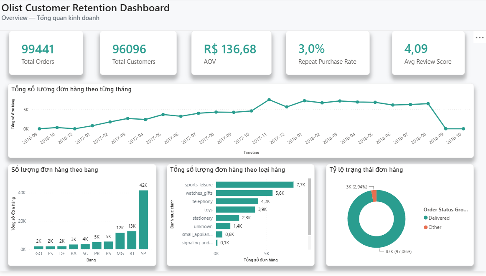
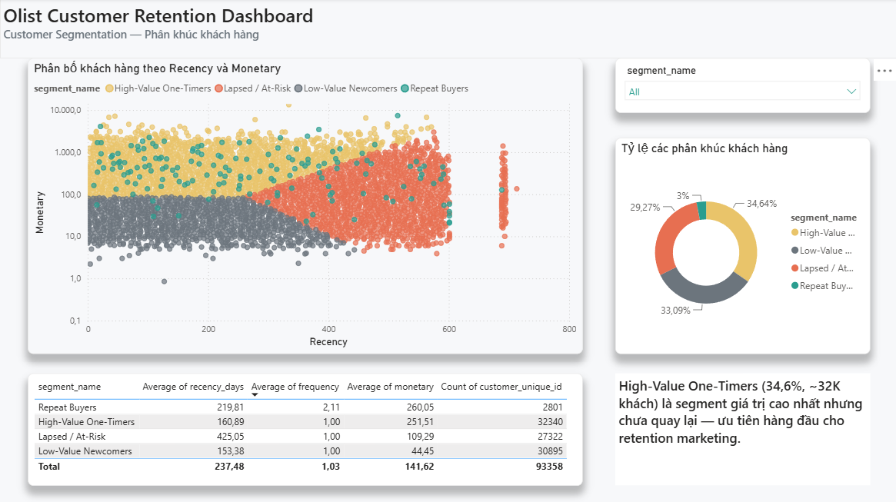

# Olist Customer Retention & Repeat-Purchase Analysis


End-to-end data analytics project on the [Olist Brazilian E-Commerce dataset](https://www.kaggle.com/datasets/olistbr/brazilian-ecommerce) (~99K orders, ~96K customers, 2016-2018) — from raw SQL to a Power BI dashboard, covering data engineering, customer segmentation, predictive modeling, and cohort analysis.

## Business Problem

Olist's customer repeat-purchase rate is critically low (~3%). This project identifies **which customers are most likely to return**, **what drives (or fails to drive) repeat purchase**, and **how retention budget should be allocated** for maximum ROI.

## Key Results

- Segmented **96,096 customers** into 4 actionable groups via RFM + K-Means; identified **"High-Value One-Timers"** (34.6% of customers, highest per-order value, never returned) as the top retention-marketing priority

## Dashboard Preview


**Overview**


**Customer Segmentation**



## Tech Stack

- **Database**: PostgreSQL (window functions, CTEs, aggregation)
- **Python**: Pandas, NumPy, Scikit-learn, XGBoost, Matplotlib, Seaborn
- **BI**: Power BI (custom theme, conditional formatting, DAX)
- **Tooling**: Git, python-dotenv, SQLAlchemy

## Project Structure

```
olist-customer-retention/
├── data/
│   ├── raw/                   
│   └── processed/            
├── sql/
│   ├── 01_create_tables.sql
│   ├── 02_data_cleaning_and_join.sql
│   ├── 03_rfm_features.sql
├── scripts/
│   ├── data_loader.py  
│   ├── export_orders_flat.py
│   ├── export_customer_rfm.py
├── notebooks/
│   ├── 01_eda.ipynb
│   ├── 02_rfm_segmentation.ipynb
├── reports/
│   ├── figures/
│   ├── eda_summary.md│
│   └── final_summary.md
├── dashboard/
│   └── olist_dashboard.pbix
├── erd.dbml
├── requirements.txt
└── .env
```

## Methodology

1. **Data Engineering** — Loaded 9 raw tables into PostgreSQL, cleaned and joined into a single order-grain table (`orders_flat`), correctly distinguishing `customer_id` (per order) from `customer_unique_id` (true customer identity). [`sql/01-02`]
2. **Exploratory Data Analysis** — Order status, geographic concentration, category mix, review distribution, delivery performance. [`notebooks/01_eda.ipynb`]
3. **Customer Segmentation** — RFM features computed in SQL, K-Means clustering (k=4) in Python, segments validated against the independently-measured repeat rate. [`sql/03`, `notebooks/02`]
4. **Dashboard** — 2-page Power BI dashboard (Overview, Segmentation) with a custom minimalist theme.

## Key Findings

### Customer Segments (RFM + K-Means)

| Segment | % of Customers | Count | Avg Recency (days) | Avg Frequency | Avg Monetary (R$) |
|---|---|---|---|---|---|
| Repeat Buyers | 3.0% | 2,801 | 219.8 | 2.1 | 260.1 |
| High-Value One-Timers | 34.6% | 32,340 | 160.9 | 1.0 | 251.5 |
| Low-Value Newcomers | 33.1% | 30,895 | 153.4 | 1.0 | 44.5 |
| Lapsed / At-Risk | 29.3% | 27,322 | 425.0 | 1.0 | 109.3 |


## Limitations

- Dataset covers Brazil, 2016–2018 only; findings may not generalize to other markets/periods
- The prediction model uses only static first-order features — no post-purchase engagement data (email, customer service, app usage) was available


## How to Reproduce

```bash
# 1. Clone and set up environment
git clone <your-repo-url>
cd olist-customer-retention
python -m venv venv
source venv/bin/activate  # Windows: venv\Scripts\activate
pip install -r requirements.txt

# 2. Set up PostgreSQL credentials
cp .env.example .env  # then fill in your real DB credentials

# 3. Download the dataset from Kaggle into data/raw/
#    https://www.kaggle.com/datasets/olistbr/brazilian-ecommerce

# 4. Run SQL + Python pipeline in order
psql -U postgres -d olist_db -f sql/01_create_tables.sql
python scripts/load_data.py
psql -U postgres -d olist_db -f sql/02_data_cleaning_and_join.sql
python scripts/export_orders_flat.py
psql -U postgres -d olist_db -f sql/03_rfm_features.sql
python scripts/export_customer_rfm.py

# 5. Run notebooks in order (01 -> 04) inside notebooks/

# 6. Open dashboard/olist_dashboard.pbix in Power BI Desktop
```

## Author

**Nguyễn Phúc An** — Information Systems student, [Ho Chi Minh City University of Technology and Education])
